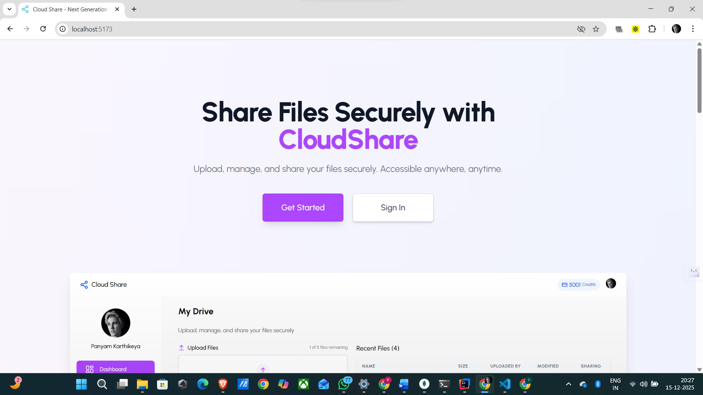
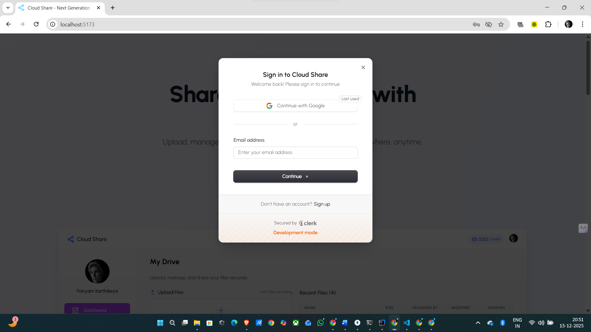
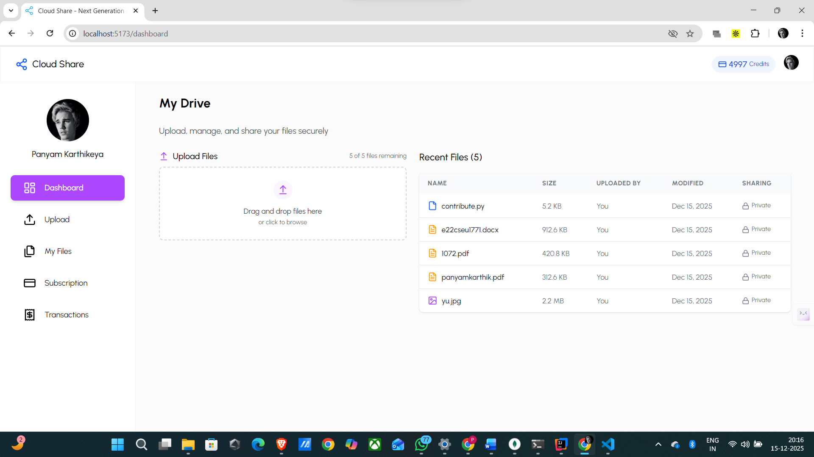
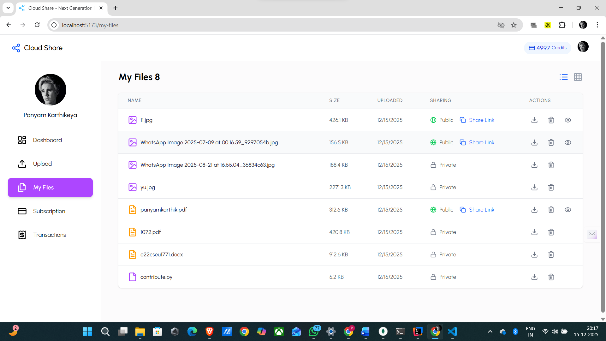
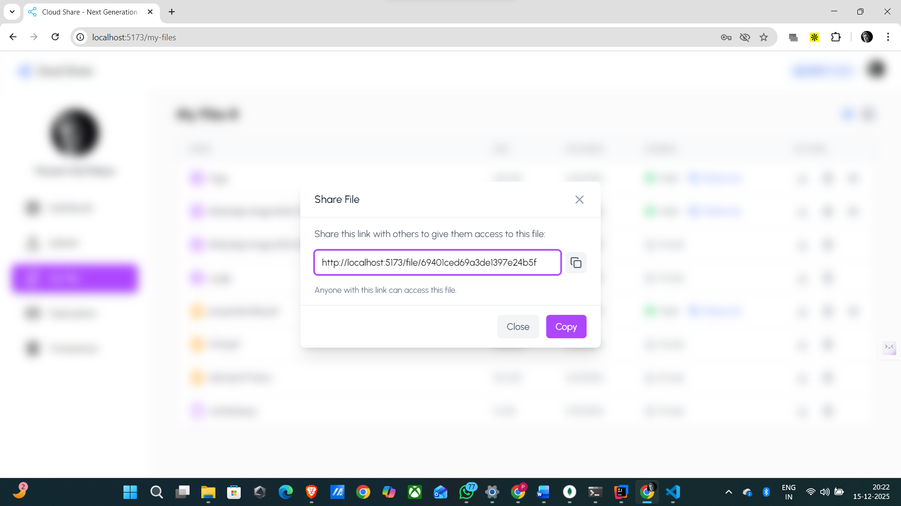
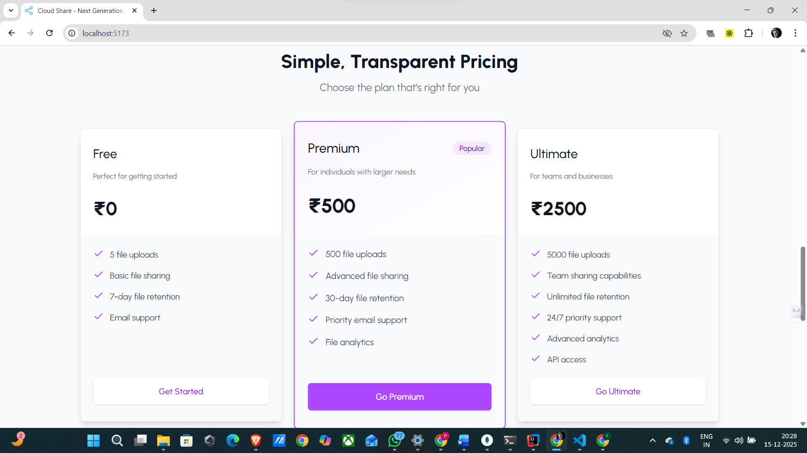
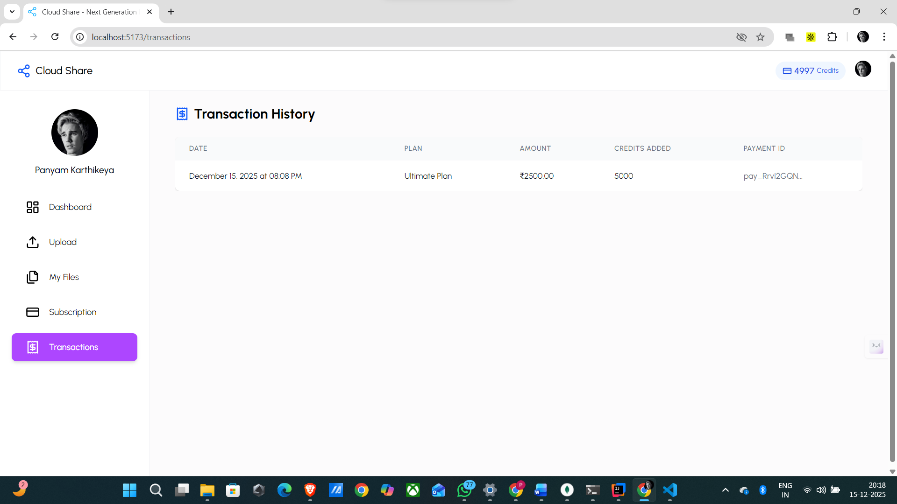
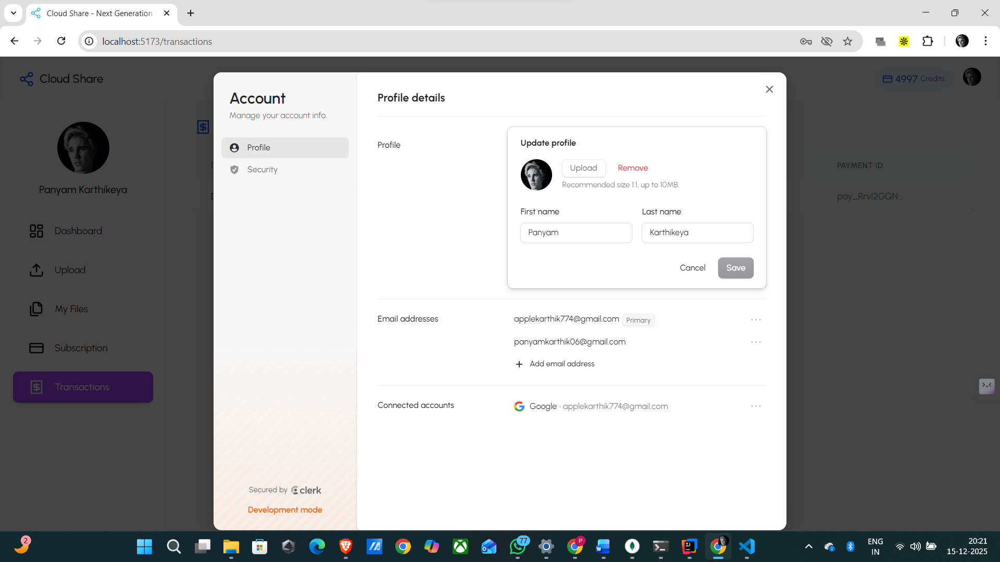

# ☁️ CloudShare – Next Generation File Sharing App

CloudShare is a **secure, modern, full-stack file sharing platform** that allows users to upload, manage, and share files with public or private access.  
Built using **React & Spring Boot**, it supports authentication, subscriptions, payments, and a clean SaaS-style UI.

> 🔐 Secure • 🚀 Fast • 🎨 Modern • 💳 Subscription-based

---

## 🌟 Features

### 🔐 Authentication & Security
- Secure authentication using **Clerk**
- Google OAuth login
- Profile & security management
- Active device tracking

### 📁 File Management
- Upload, view, download & delete files
- Public / Private toggle for files
- Share public files via unique links
- Access files directly using shared links

### 🖥️ User Interface
- Beautiful & responsive UI using **Tailwind CSS**
- Modern icons using **Lucide Icons**
- Grid & List views for files
- Dashboard with recent files

### 💳 Subscriptions & Payments
- Free, Premium & Ultimate plans
- Credit-based file usage system
- Razorpay integration (Test Mode)
- Transaction history tracking

### ⚙️ Full-Stack Integration
- React frontend + Spring Boot backend
- REST APIs for file & payment handling
- MongoDB for file & metadata storage

---

## 🛠️ Tech Stack

### Frontend
- **React.js**
- **Tailwind CSS**
- **Lucide Icons**
- **Clerk Authentication**

### Backend
- **Spring Boot**
- **Java**
- **MongoDB**
- **REST APIs**

### Payments
- **Razorpay (Test Mode)**

---

## 📸 Screenshots

Create a folder named **`screenshots`** in your repository and add images.

```md











🧑‍💻 Installation & Setup
Prerequisites

Node.js (v18+)

Java 17+

MongoDB

Maven

🔹 Frontend Setup
cd frontend
npm install
npm run dev


Frontend runs on:

http://localhost:5173

🔹 Backend Setup
cd backend
mvn clean install
mvn spring-boot:run


Backend runs on:

http://localhost:8080

🔹 Environment Variables
Frontend (.env)
VITE_CLERK_PUBLISHABLE_KEY=your_clerk_key

Backend (application.properties)
spring.data.mongodb.uri=your_mongodb_uri
razorpay.key.id=your_key
razorpay.key.secret=your_secret

⚠️ Important Note on Storage

📌 Current Implementation
Files are stored directly in MongoDB for simplicity during development.

🚀 Planned Improvement
Cloud storage integration (AWS S3 / Firebase / Cloudinary) will be added in future updates.

🔮 Future Enhancements

☁️ Cloud storage integration (AWS S3)

🔑 Password-protected shared links

⏳ File expiry & auto-delete

📊 Advanced analytics

👥 Team & folder sharing


📂 Project Tags

React File Upload

Spring Boot File Upload API

Full Stack Project 2025

MongoDB Spring Boot Integration

Clerk Auth React

File Sharing App

SaaS Portfolio Project

👤 Author

Panyam Karthikeya


⭐ If you like this project, don’t forget to star the repository!